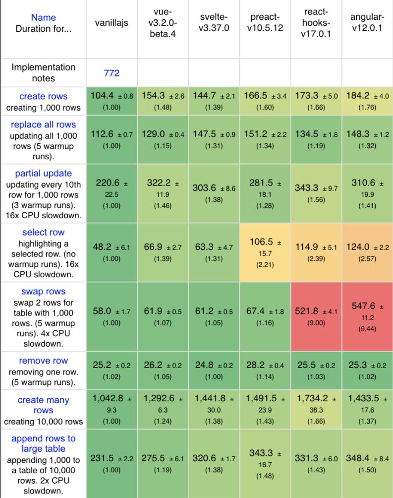
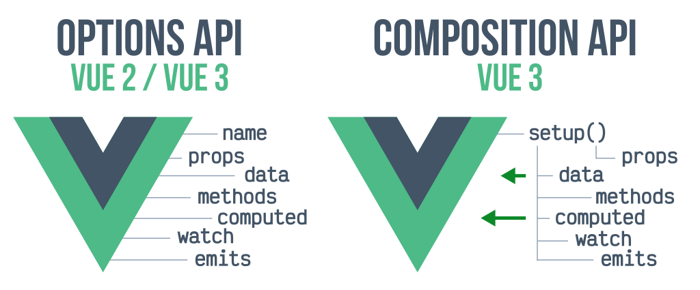
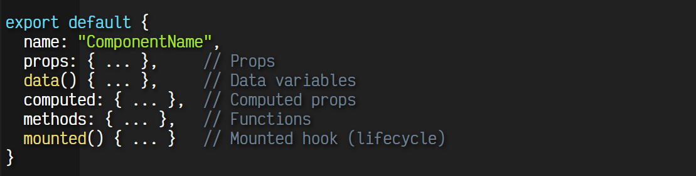
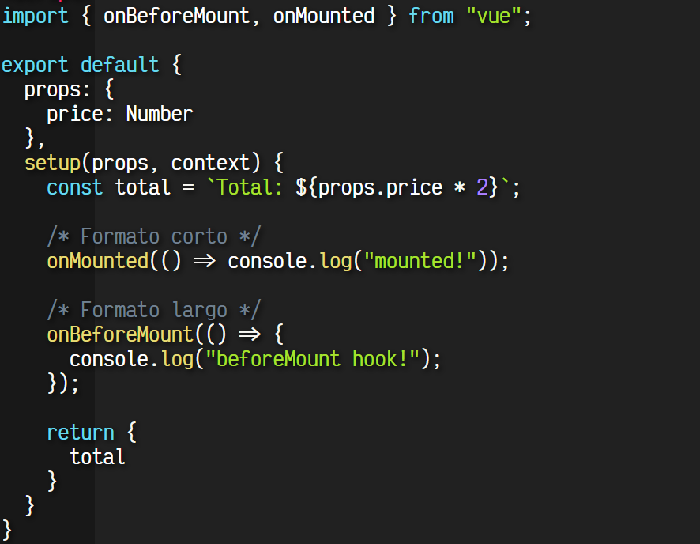
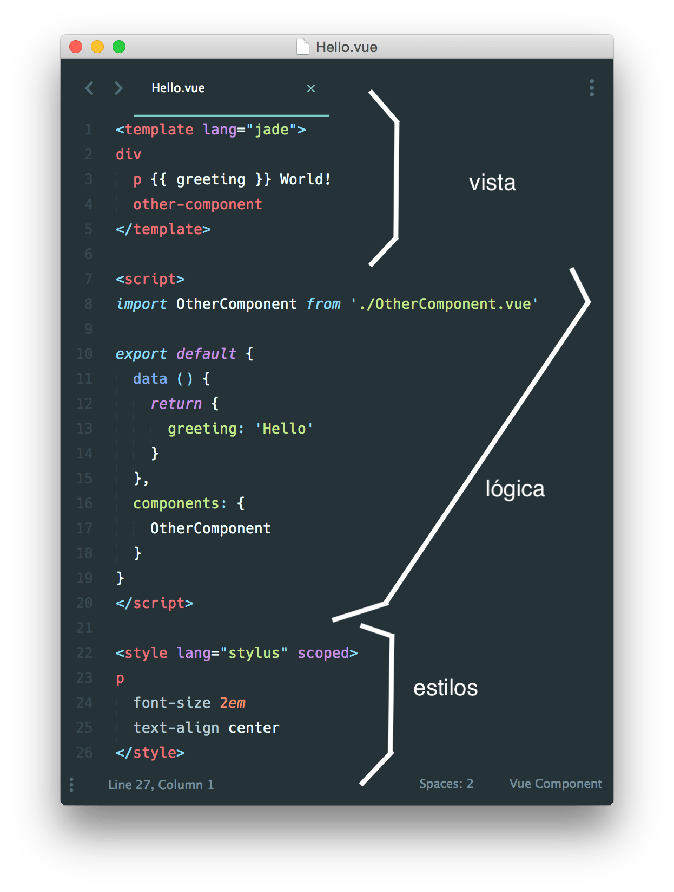

# Introducción a Vue

<!--
Bienvenidos a esta introducción a Vue

el objetivo de esta charla es presentaros qué es Vue a día de hoy, presentaros sus ventajas y novedades e introduciros a su formato para que podáis usarlo desde hoy mismo.
-->

---
<!-- _class: lead -->

# ¿Qué es Vue?

---
<!-- _class: lead -->

- Framework progresivo
- Facilidad de uso
- Rendimiento
- Flexibilidad
- Promueve buenos patrones de desarrollo
- Mantenido por la comunidad

<!--
  Framework progresivo - permite usarlo como librería e integrarlo en cualquier parte de forma sencilla; pero a su vez te permite agregar más piezas hasta convertirlo en un framework tan completo como Angular.

  Creado por Evan You en 2014, tras trabajar en Google en varios proyectos con AngularJS.

  Se ha basado en las buenas prácticas y ventajas de otros frameworks (como alguna sintaxis desde Angular, VirtualDOM como React) y mejorándolas en lo que era posible (VueX, Scoped CSS, composables)

  Sus objetivos desde el principio son: ...

  Comparemoslo con los frameworks más populares
-->

---
<!-- _class: lead -->

# Vue vs the rest

<!-- En esta comparación nos centraremos en las ventajas de cada uno de ellos para compararlas -->
---
<!-- _class: lead -->

# Vue vs Angular

---

# Pros de Angular
- Solución todo en uno, todo integrado
- Gran soporte TypeScript
- Dogmático
- Respaldado por Google
- Comunidad muy numerosa
- Angular/CLI

---

# Pros de Vue
- Solución personalizable con opciones oficiales
- Soporte JS / TS
- Muy flexible
- Menor curva de aprendizaje
- Desarrollo más ágil
- Más rápido y ligero
- Vue/CLI

---
<!-- _class: lead -->

# Vue vs React

---

# Pros de React
- Soporte JS / TS
- Hooks
- Muy flexible
- Ecosistema de paquetes muy rico
- Comunidad y uso muy amplio
- Respaldado por Facebook

---

# Pros de Vue
- Soporte JS / TS
- Composables
- Muy flexible + opciones defecto potentes _(VueX, Router, etc.)_
- Mayor rendimiento
- Soporte opcional de JSX

---
<!-- _class: lead -->
<!-- footer: 'github.com/krausest/js-framework-benchmark' -->

# Rendimiento

<!-- Su rendimiento es similar al de Svelte, superándolo en algunos casos y muy cercano a JS vanilla; y sobretodo muy superior al de React y Angular en la mayoría de los casos

* Basado en el test de https://github.com/krausest/js-framework-benchmark -->

---
<!-- _class: lead -->
<!-- footer: '' -->
# Composition API

---

# Options API vs Composition API

---

# Componente Options API

---
# Composition API
- Facilidad para crear aplicaciones grandes y fáciles de mantener
- Forma de trabajo más cercano a js vanilla
- Nuevo método (setup) para inicializar el componente (equivalente al constructor)
- Ciclo de vida más sencillo
- Mejora la capacidad de crecimiento de un proyecto y la reutilización de componentes
- Mejora en el manejo de la reactividad
---

# Setup
Se añade el hook setup() para crear lógica de inicialización del componente. En el interior de setup() se realizan varias operaciones principales:

- Tareas de inicialización o ciclo de vida
- Tareas de definición
- Devolución de elementos a utilizar

---

---
# Estructura de archivos app / componente Vue

Normalmente:

- app.js
- index.html
- style.css

Utilizando VueFiles (Single File Component)

- componente.vue

---
# Partes del VueFile

- `<template>`
	- En esta parte se añade el código html, pudiendo incluso utilizarse preprocesadores

- `<script>`
	- En esta parte se escribe el código js, pudiendo también utilizarse Ts

- `<style>`
	- Aquí escribiremos los estilos, pudiendo utilizar distintos lenguajes

---
# Hello.vue

---
<!-- _class: lead -->
# Pros & Cons del VueFile

---

## Ventajas:

- Reutilización y portabilidad
	- La reutilización se simplifica, los componentes son más portables al vivir en un sólo archivo
- Bajo acoplamiento
	- El acoplamiento se reduce, al ser el mecanismo de importación más sencillo

---
## Inconvenientes:

- Lines per file
	- Por la naturaleza del formato, el número de líneas por archivo puede llegar a crecer mucho
- Impacto en el desarrollo
	- Mucho scroll para saltar de zona
- Extrañeza
	- Este formato puede resultar difícil para desarrolladores que vengan de otros frameworks

---
# Extra: Diff con Styled Components

Referencia Styled components de React (Librería Emotion)

Con los styled components lo que hacemos es un "override" de los estilos de una tag html, para utilizarlo en nuestro componente

Con los vuefile lo que hacemos es encapsular en un sólo archivo toda la funcionalidad de una app o componente Vue, incluyendo sus estilos, siendo estos todo lo ricos que queramos.

---
<!-- _class: lead -->
# Gracias!