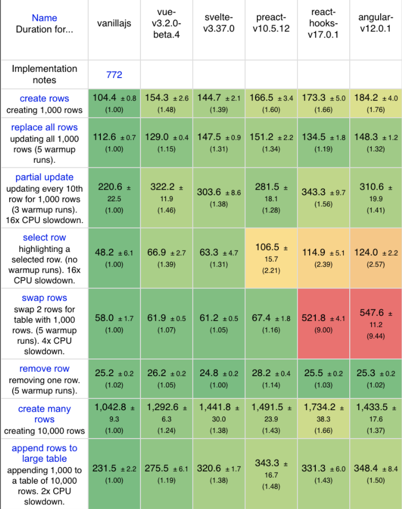

# Qué es Vue 3?

<!-- Notas al pie -->

---
<!-- _class: lead -->

- Framework progresivo
- Facilidad de uso
- Rendimiento
- Flexibilidad
- Promueve buenos patrones de desarrollo
- Mantenido por la comunidad

<!--
  Creado por Evan You en 2014
  Se ha basado en las buenas prácticas de otros frameworks
  mejorándolas en lo que era posible (VueX, Scoped CSS)
-->

---
<!-- _class: lead -->

# Vue vs the rest

---
<!-- _class: lead -->

# Vue vs Angular

---

# Pros de Angular
- Solución todo en uno, todo integrado
- Gran soporte TypeScript
- Dogmático
- Respaldado por Google
- Comunidad muy numerosa

---

# Pros de Vue
- Curva de aprendizaje menor
- Desarrollo más ágil
- Rendimiento
- Más ligero
- Más flexible
- Soporte JS / TS

---
<!-- _class: lead -->

# Vue vs React

---

# Pros de React
- Soporte JS / TS
- Hooks
- Muy flexible
- Ecosistema de paquetes muy rico
- Comunidad y uso muy amplio
- Respaldado por Facebook

---

# Pros de Vue
- Soporte JS / TS
- Composables
- Muy flexible + opciones defecto potentes
- Rendimiento
- Soporte opcional de JSX
- Side effects incluidos en VueX

---
<!-- _class: lead -->
<!-- footer: 'github.com/krausest/js-framework-benchmark' -->

# Rendimiento

<!-- Su rendimiento es similar al de Svelte, superándolo en algunos casos y muy cercano a JS vanilla; y sobretodo muy superior al de React y Angular en la mayoría de los casos

* Basado en el test de https://github.com/krausest/js-framework-benchmark -->