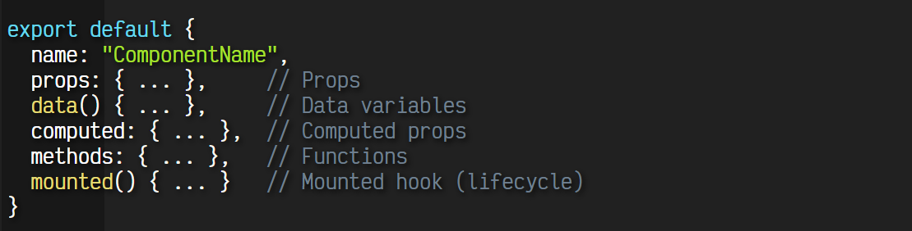

# Composition API

---

# Options API vs Composition API

---

# Componente Options API

---
# Composition API
- Facilidad para crear aplicaciones grandes y fáciles de mantener
- Forma de trabajo más cercano a js vanilla
- Nuevo método (setup) para inicializar el componente (equivalente al constructor)
- Ciclo de vida más sencillo
- Mejora la capacidad de crecimiento de un proyecto y la reutilización de componentes
- Mejora en el manejo de la reactividad
---

# Setup
Se añade el hook setup() para crear lógica de inicialización del componente. En el interior de setup() se realizan varias operaciones principales:

- Tareas de inicialización o ciclo de vida
- Tareas de definición
- Devolución de elementos a utilizar

---

